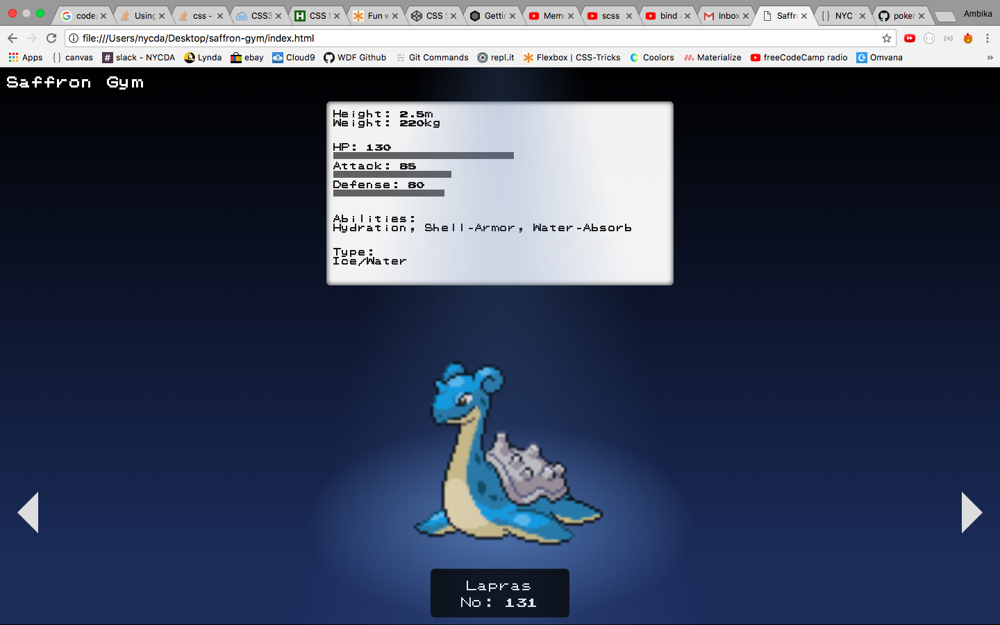

# Pokemon Group Project
# Pokemon Gym

## Utilizes
* Pokemon API
* CSS
* jQuery
* Materialize
* AJAX

## Collaboration 
### Collectively
* Compared and merged JavaScript
* Created a completely new design
* Found a basic spot light design we really liked and worked on making it work for our project
* Worked on CSS

### Kay
* Merged the two Trainer classes into one Gym class
* Used JavaScript to change background colors of main div (Later deleted to accomodate new design)
* Responsible for creating Github repository and merging pull requests

### Ambika
* Created a hover for the Pokemon image that shows the stats when image is hovered-over
* Made changes to title, background and flexbox

### Desktop view:

## Features:
* "Stats" that appear when Pokémon image is hovered-over
* "Arrow" button that navigates to a new Pokémon by making an AJAX call to the API
* Materialize Preloader that improves the UX while AJAX calls are being made
* Spotlight background to create a gym-like feel

## Acknowledgements
* [Pokémon GAME BOY Font](https://github.com/Superpencil/pokemon-font/) by Superpencil
* Inspiration: [Pokedex.org](https://www.pokedex.org/)
