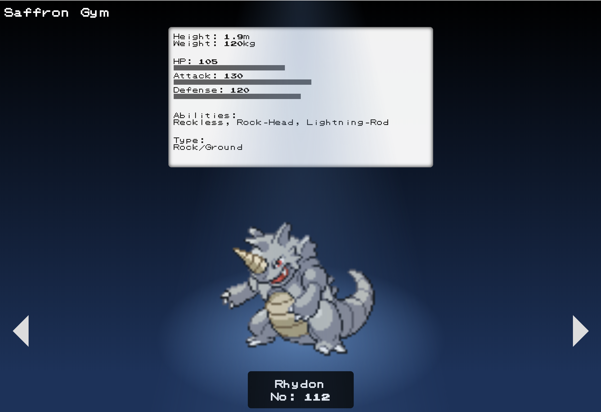

# Saffron Gym
## A Collaborative Showcase of Six Pokémon

## Utilizes
* Pokémon API
* AJAX
* jQuery
* Materialize
* CSS

Stats are hidden by default:

Stats are shown when user hovers over Pokémon image:

## Collaboration
### Collectively:
* Compared and merged JS files
* Created a completely new design
* Incorporated and made adjustments to spotlight code to work with existing elements
* Used Flexbox within Flexbox to correctly align elements to work across a variety of viewport widths

### Kay:
* Merged two Trainer classes into one Gym class
* Used JavaScript to change background colors of main div (Later discarded to accommodate new design)
* Responsible for creating Github repository and merging pull requests

### Ambika:
* Initialized Flexbox to position elements according to design
* Added a hover event listener to show info display and anchored it to the Pokémon image
* Created Gym name and removed unused elements

## Features:
* Spotlight created only using CSS to resemble an arena
* Stats appear when Pokémon image is hovered over
* Navigational arrow buttons
* Materialize Preloader shows when AJAX calls are being made

## Acknowledgements
* [Pokémon GAME BOY Font](https://github.com/Superpencil/pokemon-font/) by Superpencil
* [Animated Spotlight](https://codepen.io/tutsplus/pen/PqbPGZ?editors=110) by Envato Tuts
